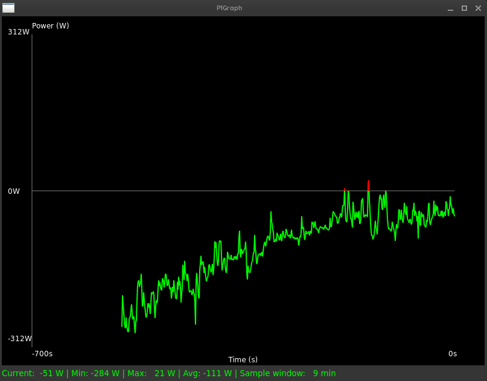
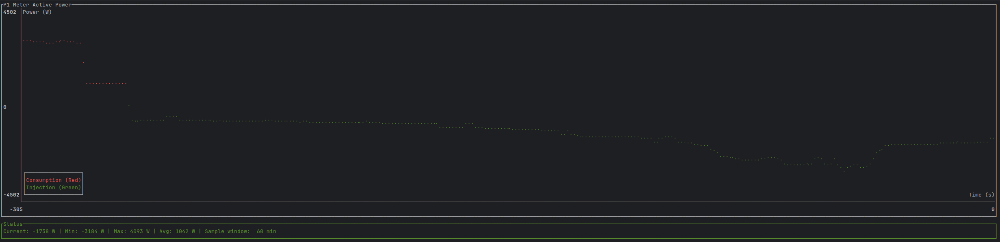

# P1Graph

A Rust application to visualize P1 meter active power data. It works with the P1-meter offered by homewizard.com.
Available here at https://www.homewizard.com/shop/wi-fi-p1-meter/ and the API is documented at https://api-documentation.homewizard.com/docs/introduction/


## Description

P1Graph connects to the P1 meter using the v1 REST interface to fetch active power data and displays it as a real-time chart. 

The application offers two UI variants:
*   **GTK-based UI:** A graphical window that is automatically used when a graphical environment (X11 or Wayland) is detected.
*   **Text-based UI (TUI):** A terminal-based interface using `ratatui` that is used as a fallback or when explicitly requested.

Both variants show consumption (red) and injection (green) of power, along with current, min, max, and average power values.

## How to Run

1.  **Build the project:**
    ```bash
    cargo build --release
    ```

2.  **Run the application:**
    Specify the IP address of your P1 meter API using the `--ip` argument.

    ```bash
    ./target/release/P1Graph --ip 192.168.1.192
    ```
    Replace `192.168.1.192` with the actual IP address of your P1 meter.



    To force the text-based UI even in a graphical environment, use the `--text-ui` flag:
    ```bash
    ./target/release/P1Graph --ip 192.168.1.192 --text-ui
    ```



## Controls

*   Press `q` or `Esc` to quit the application.
